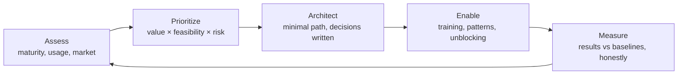
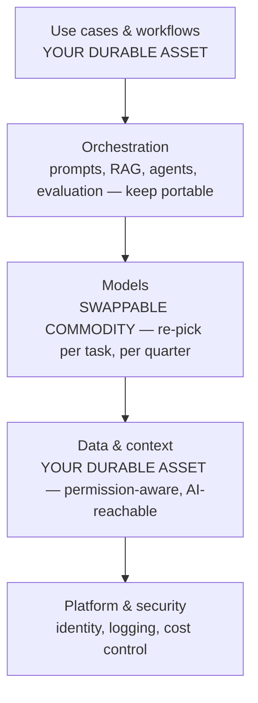

# The AI Architect's Perspective

Every organization adopting AI eventually needs someone who owns the *whole picture*: which use cases matter, how they fit the systems landscape, what the guardrails are, and how today's choices keep tomorrow's options open. That role is the **AI architect**. In large enterprises it's a full-time position (or a team); in small and mid-sized organizations it is increasingly filled **fractionally** — a senior external expert embedded a few days per month. This article describes how that role sees the world.

## What an AI Architect Actually Owns

The role sits at the intersection of strategy, technology, and governance:

- **Portfolio** — maintain the use-case backlog; score, sequence, and kill initiatives; balance quick wins against structural bets
- **Architecture** — decide how AI capabilities connect to the systems and data landscape; prevent one-off point solutions from accumulating into unmaintainable sprawl
- **Vendor & model strategy** — choose platforms and models; avoid lock-in; renegotiate as the market shifts (it shifts quarterly)
- **Governance & risk** — data classification, human-in-the-loop rules, regulatory posture (e.g. EU AI Act), auditability
- **Capability building** — make the organization progressively less dependent on any single expert, including the architect

What the role is **not**: a prompt wizard, a data engineer, or a vendor's implementation partner. The architect's loyalty is to the organization's long-term option value.

## The Operating Loop

A fractional AI architect runs a repeating loop, typically on a monthly or quarterly cadence:

1. **Assess** — benchmark maturity, inventory usage (official and shadow), review what changed in the market
2. **Prioritize** — re-score the use-case portfolio on value × feasibility × risk; pick the few that matter now
3. **Architect** — design the minimal technical path for the chosen initiatives; write decisions down (lightweight ADRs)
4. **Enable** — unblock teams: training, patterns, reference implementations, vendor escalations
5. **Measure** — compare results to baselines; report honestly, including failures
6. **Repeat** — capability and market both moved; adjust

The loop matters more than any single deliverable. AI strategy documents age in months; the loop doesn't.

## The AI Architecture Stack

The architect thinks in layers, and insists that each layer be swappable:

| Layer | What lives here | Key architectural question |
|---|---|---|
| **Use cases & workflows** | Assistants, automations, agents embedded in business processes | Where does a human review? What's the fallback when AI fails? |
| **Orchestration** | Prompt/agent logic, tool calling, RAG pipelines, evaluation | Is our logic portable across models, or welded to one vendor? |
| **Models** | Frontier APIs, smaller task models, occasionally self-hosted | Right model per task: capability vs. cost vs. latency vs. privacy |
| **Data & context** | Document stores, embeddings, MCP/connectors into business systems | Can AI reach the data it needs — safely, with the right permissions? |
| **Platform & security** | Identity, secrets, logging, cost controls, tenancy | Who used what, with which data, at what cost? |

**The core doctrine: your durable assets are the top and bottom layers** — redesigned workflows and well-organized, permission-aware data. Models in the middle are commodities that improve and cheapen every quarter. Architect so you can swap them.

## The Stack, Visualized

Read it as a value sandwich: the layers you own outlive every vendor decision in the middle. Every architecture review starts by checking that the middle is still swappable.

## Recurring Decision Frameworks

**Buy → Configure → Integrate → Build.** Always take the lowest rung that meets the need (see [Getting Started with AI](/articles/getting-started-with-ai)). The architect's job is often saying *no* to building.

**Model selection per task.** Match model tier to task stakes and volume: frontier models for complex reasoning and customer-visible quality; fast, cheap models for high-volume classification and extraction. Re-evaluate quarterly — yesterday's frontier capability is today's budget tier.

**Human-in-the-loop by risk tier.**
- *Low stakes, reversible* (internal drafts, search): AI autonomous, spot-check
- *Medium stakes* (customer replies, code): AI drafts, human approves
- *High stakes* (financial, legal, safety, personnel decisions): AI assists analysis only; humans decide — often also a regulatory requirement

**Lock-in calculus.** Some lock-in is fine (it buys speed); unpriced lock-in is not. Keep prompts, evaluation sets, and data pipelines portable. An evaluation suite you own is the single best anti-lock-in asset: it lets you re-test any new model against your real tasks in a day.

**Evaluate before you scale.** No AI workflow goes to production without a test set of real cases and an agreed quality bar. "It looked good in the demo" is not an acceptance criterion.

## What Changes with Organization Size

The principles are constant; the shape of the engagement is not.

| | Small (≤50 FTE) | Mid-size (50–500 FTE) | Enterprise (500+ FTE) |
|---|---|---|---|
| **Architect model** | Fractional, 1–3 days/month | Fractional-to-part-time, plus an internal champion | Internal team; external architect for strategy & review |
| **Focus** | Horizon 1 fluency + 1–2 integrations that punch above weight | Portfolio discipline, first platform choices, governance that scales | Federated operating model, platform standards, risk & compliance at scale |
| **Governance** | One-page policy, sanctioned tools | Policy + intake process + risk tiers | AI review board, audit trails, regulatory alignment |
| **Trap to avoid** | Tool sprawl and no measurement | Every department buying its own AI stack | Governance so heavy nothing ships |

Small organizations get a structural advantage here: they can adopt in weeks what takes an enterprise quarters. A fractional architect lets them do it with enterprise-grade judgment they couldn't otherwise afford.

## The First 30 Days of an Engagement

A well-run fractional engagement starts the same way regardless of company size:

1. **Maturity audit** — run the [AI Maturity Audit](/articles/ai-maturity-assessment); interview leadership and the floor; inventory tools, data, and shadow usage
2. **Positioning readout** — where you are vs. peers of your size; the two or three dimensions holding you back
3. **Portfolio draft** — 10–20 candidate use cases from the business functions map, scored; top 3 selected with owners and baselines
4. **Foundations check** — sanctioned tooling, one-page policy, measurement habit in place
5. **Roadmap & cadence** — a 2–3 quarter roadmap and the recurring operating loop agreed

From there, the loop runs — and the architect's success metric is deliberately paradoxical: **the organization needs them a little less every quarter**, because judgment, patterns, and fluency have been transferred inward.

## Signals of a Healthy AI Function

- Decisions are written down and revisited on a cadence — not relitigated ad hoc
- Every production AI workflow has an owner, a baseline, an eval set, and a fallback
- Model/vendor choices have exit paths that have actually been tested
- The use-case backlog is public inside the company, and things get killed, not just added
- Spend, usage, and outcomes are visible on one page
- People at every level can say what AI is for *in their own workflow* — not just in the company deck

> **Where to go next:** the architect's judgment is anchored in [Team-First AI](/articles/team-first-ai) — the six questions every engagement walks through. [The AI Maturity Audit](/articles/ai-maturity-assessment) is the assessment instrument this role runs first; [AI Across Business Functions](/articles/ai-in-business-functions) is the use-case map it draws from.
