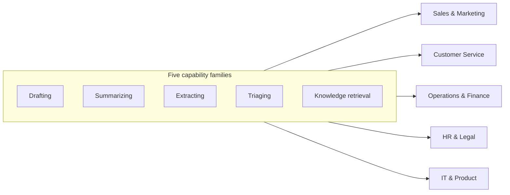

# AI Across Business Functions

AI strategy becomes real the moment it is expressed in the language of business functions: *this team, this workflow, this metric.* This article maps the highest-yield AI applications per function, split into **quick wins** (assistant-level, live in days–weeks) and **deeper plays** (integration-level, weeks–months). Use it as a menu during use-case discovery — not everything applies to every organization, but every organization will find its next three projects in here.

A pattern worth noticing up front: across every function, the same five capability families recur — **drafting, summarizing, extracting, classifying/triaging, and retrieving knowledge**. Master these patterns once and they transfer everywhere.

## The Five Families, Visualized

Every function section below is one of these five families, applied to a specific workflow.

## Sales & Marketing

**Quick wins**
- Draft outreach, proposals, and follow-ups from call notes and CRM context
- Meeting/call summaries pushed into the CRM automatically
- Content repurposing: one webinar → posts, emails, landing copy — in brand voice
- Competitor and account research briefs on demand

**Deeper plays**
- RAG assistant over your case studies, pricing rules, and past proposals — first-draft proposals grounded in what actually won before
- Lead scoring and enrichment pipelines; intent triage on inbound
- Personalization at scale: segment-of-one email and landing variants, systematically A/B tested

**Metrics:** proposal turnaround time, pipeline touched per rep, content cycle time, win rate on AI-assisted proposals.

## Customer Service & Support

Often the fastest payback in the company — high volume, language-heavy, well-documented.

**Quick wins**
- Agent-assist: suggested replies grounded in the knowledge base; tone and language polishing
- Automatic ticket summarization and categorization; call wrap-up notes
- Knowledge-base article drafting from resolved tickets

**Deeper plays**
- Customer-facing assistant over the documented knowledge base, with confident handoff to humans
- Full triage automation: classify, prioritize, route, and draft — human approves
- Voice-of-customer mining: trends, emerging issues, and product feedback from every conversation, not a sample

**Metrics:** first-response time, resolution time, deflection rate (with quality floor), CSAT, cost per contact.

## Operations & Supply Chain

**Quick wins**
- Document extraction: orders, delivery notes, customs forms, supplier certificates → structured data
- SOP and work-instruction drafting/updating; instant multilingual versions
- Meeting-to-action-list automation for planning cycles

**Deeper plays**
- Email-and-PDF order intake automated end-to-end into the ERP
- Exception triage: AI monitors alerts/queues, investigates the routine ones, escalates the rest with context
- Demand-forecast narrative and scenario analysis on top of existing planning tools

**Metrics:** order intake cycle time, touchless-processing rate, error rates, planner hours per cycle.

## Finance & Administration

**Quick wins**
- Invoice and expense document extraction and matching support
- First-draft management commentary: monthly report narratives from the numbers
- Policy Q&A assistant ("can I book this as…?") over the finance handbook

**Deeper plays**
- Accounts-payable pipeline: capture → extract → match → propose booking; humans approve exceptions
- Contract review support: extract obligations, renewal dates, deviations from standard terms
- Continuous anomaly narration on spend and transactions

**Metrics:** days to close, cost per invoice processed, exception rate, audit findings.

**Risk note:** finance is a high-stakes domain — AI proposes, humans approve, and every figure that leaves the department is human-verified. Design the review step in; don't bolt it on.

## Human Resources

**Quick wins**
- Job-ad drafting and de-biasing; interview-question kits per role
- CV-to-requirements first-pass screening *as decision support* (see risk note)
- HR policy assistant for employees ("how does parental leave work here?")

**Deeper plays**
- Onboarding companion: role-specific 30/60/90 guidance grounded in internal docs
- Internal mobility and skills mapping from role and project data
- Engagement-survey and exit-interview synthesis at full coverage

**Metrics:** time-to-hire, recruiter hours per hire, HR ticket deflection, onboarding time-to-productivity.

**Risk note:** hiring and personnel decisions are **high-risk under the EU AI Act**. AI may assist analysis; humans decide, criteria stay transparent, and outcomes are monitored for bias. This is the domain where governance discipline is most load-bearing. On timing: high-risk (Annex III) obligations were originally set to apply from 2 August 2026, but the ["Digital Omnibus on AI"](https://artificialintelligenceact.eu/implementation-timeline/) — formally adopted and in force since 27 July 2026 — defers stand-alone Annex III obligations to 2 December 2027 (AI embedded in regulated products under Annex I moves to 2 August 2028) — treat the extra time as runway for building the practices above, not as a reason to wait.

## Legal & Compliance

**Quick wins**
- Contract summarization and clause extraction; deviation-from-playbook flagging
- First-draft NDAs and standard agreements from templates
- Regulatory horizon scanning summaries

**Deeper plays**
- Contract lifecycle assistant over the full repository: obligations, renewals, exposure queries
- Compliance-evidence assembly: collect, organize, and draft against control frameworks

**Metrics:** contract turnaround time, external counsel spend on routine work, obligation-tracking coverage.

## IT & Software Engineering

Usually the most AI-mature function already — the architect's job is to systematize it.

**Quick wins**
- AI-assisted coding in the IDE; PR summaries and first-pass review
- Documentation, test, and migration-script generation
- Helpdesk assist over the internal IT knowledge base

**Deeper plays**
- Agentic development workflows: AI implements scoped changes, runs tests, opens PRs (e.g. Claude Code — see the [Claude Code Enterprise Toolkit](/articles/service-offerings))
- Legacy-code understanding and modernization programs
- Incident-response copilot: log summarization, hypothesis generation, post-mortem drafts

**Metrics:** cycle time, review turnaround, defect escape rate, developer-hours per feature, backlog age.

## Product & R&D

**Quick wins**
- Research synthesis: papers, patents, user feedback → structured briefs
- Feedback clustering across support tickets, reviews, sales notes — full coverage instead of sampling
- Spec and PRD drafting; edge-case brainstorming

**Deeper plays**
- Prototype-at-the-speed-of-thought: AI-assisted building compresses idea-to-testable-prototype from weeks to days
- AI features in your own product — start with the same patterns you've proven internally

**Metrics:** discovery cycle time, prototype throughput, feedback-to-insight latency.

## Executive & Cross-Functional

- Board and management reporting: first-draft narratives, consistency checks across decks
- Meeting infrastructure: summaries, decisions, and action tracking as an organizational habit
- Company-wide knowledge assistant — the single highest-leverage *shared* investment, and the natural first "deeper play" for most organizations
- Strategic analysis sparring: scenario stress-testing, pre-mortems, red-teaming plans

## How to Use This Map

1. During discovery, walk each function owner through their section and shortlist what resonates
2. Score candidates on **value × feasibility × risk**; favor quick wins in functions with engaged leaders
3. Deliberately reuse capability families (extraction, RAG, triage) across functions — the second deployment of a pattern costs a fraction of the first
4. Attach every selected use case to a metric its function owner already reports on. If no existing metric moves, question the use case.

> **Where to go next:** benchmark which functions are ready with the [AI Maturity Audit](/articles/ai-maturity-assessment); sequence the portfolio using [Getting Started with AI](/articles/getting-started-with-ai). This map is one input to Question 1 of [Team-First AI](/articles/team-first-ai) — it doesn't replace naming your own business problem, it shows where similar problems have paid off elsewhere.
