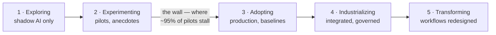

# The AI Maturity Audit: Positioning Your Organization

Before deciding what to do with AI, an organization needs an honest answer to a simpler question: *where are we today?* This audit is a reusable instrument for answering it. It scores an organization across six dimensions, places it on a five-stage maturity model, and — crucially — **calibrates expectations by company size**, because "good for a 30-person firm" and "good for a 3,000-person enterprise" are different things.

**Time to complete:** 60–90 minutes of interviews plus a short tools/data inventory.
**Output:** a maturity score per dimension, an overall stage, a size-adjusted benchmark position, and the top 2–3 gaps to work on next quarter.

## The Five Maturity Stages

| Stage | Name | What it looks like |
|---|---|---|
| **1** | **Exploring** | Curiosity and scattered individual use. No policy, no sanctioned tools, no owner. Shadow AI is the only AI. |
| **2** | **Experimenting** | Sanctioned tools exist; a few pilots run; some training happened. Results are anecdotal; nothing is measured or in production. |
| **3** | **Adopting** | Multiple use cases in production with owners and baselines. A policy is live, a person/team owns AI, quick wins have quotable numbers. |
| **4** | **Industrializing** | AI is integrated into core systems and processes (RAG, document pipelines, agents). Evaluation, cost control, and governance are routine. Portfolio is actively managed. |
| **5** | **Transforming** | Workflows and even offerings are redesigned around AI. AI capability shapes strategy and hiring. The organization absorbs new AI capabilities as a matter of routine. |

Most organizations in 2026 sit between **1 and 3** — Stage 5 is rare and unnecessary for many; the right target depends on your industry's exposure to AI-driven change.

## The Journey, Visualized

The 2→3 transition is where most value is lost: [MIT's *GenAI Divide* study (August 2025)](https://mlq.ai/media/quarterly_decks/v0.1_State_of_AI_in_Business_2025_Report.pdf) found ~95% of enterprise GenAI pilots delivered no measurable P&L impact, with the successful minority distinguished by workflow integration — not by better models. The audit's job is to locate you on this line per dimension, and the wall between 2 and 3 is where the scorekeeping discipline of the [Team-First questions](/articles/team-first-ai) earns its keep.

## The Six Dimensions

Score each dimension **1–5** using the stage descriptions above as anchors. Score what is *actually true today*, not what is planned.

1. **Strategy & Leadership** — does spend follow a stated view of where AI creates value?
2. **Use Cases & Value** — is AI deployed against real work, and is the value measured?
3. **Data & Knowledge** — can AI reach the information it needs, safely?
4. **Technology & Integration** — standalone chat tools, or integrated capability?
5. **People & Culture** — fluency across the org, or a few enthusiasts?
6. **Governance & Risk** — guardrails that enable, or block, or don't exist?

## Dimension 1: Strategy & Leadership
Does leadership have a view on where AI creates value here — and does spending follow it?
- 1: AI absent from strategy, or pure buzzword
- 3: Prioritized use-case portfolio exists; budget allocated; results reach the leadership table
- 5: AI shapes business strategy, offerings, and operating model decisions

## Dimension 2: Use Cases & Value
Is AI actually deployed against real work, and is value measured?
- 1: No production use; demos at best
- 3: 3+ use cases in production with before/after baselines
- 5: Value tracked portfolio-wide; use cases retired and scaled deliberately; AI-enabled offerings exist

## Dimension 3: Data & Knowledge
Can AI reach the information it needs — safely?
- 1: Knowledge scattered and undocumented; no data classification
- 3: Key documents/systems accessible to AI tools with permissions respected; a classification rule ("what may go where") exists and is followed
- 5: Curated, permission-aware knowledge and data layer designed for AI consumption (search, RAG, connectors) across the business

## Dimension 4: Technology & Integration
From standalone chat to integrated capability.
- 1: Consumer chat tools only, unmanaged
- 3: Enterprise-grade assistant deployed; first API integrations or automations live
- 5: A deliberate AI platform layer: model portfolio, orchestration, evaluation, cost and usage observability; components swappable

## Dimension 5: People & Culture
Fluency, not fear.
- 1: A few enthusiasts; most staff untrained; quiet resistance or quiet shadow use
- 3: Majority of knowledge workers trained and using AI weekly; champions network active; team leads bought in
- 5: AI fluency is part of roles, hiring, and onboarding; teams redesign their own workflows; continuous learning cadence

## Dimension 6: Governance & Risk
Guardrails that enable rather than block.
- 1: No policy; nobody could say what data went into which tool last week
- 3: One-page policy live and known; human-in-the-loop rules by risk tier; usage visible; vendor data terms verified
- 5: Risk-tiered review process, audit trails, evaluation before deployment, regulatory posture (e.g. EU AI Act) actively managed — with lead times measured in days, not quarters

## Scoring and Interpretation

- **Overall stage** = average of the six dimension scores, weighted by nothing — but *read the spread, not just the average*.
- **A spread of ≥2 points between dimensions is itself the finding.** Typical failure patterns:
  - High Technology, low People → "platform nobody uses"
  - High People, low Governance → "enthusiasm heading for an incident"
  - High Strategy, low Use Cases → "slideware AI"
- The lowest one or two dimensions are almost always the right place to spend the next quarter. Maturity rises as a convoy: the slowest dimension sets the pace.

## Size-Calibrated Benchmarks: What to Prioritize

Raw scores mislead unless calibrated by organization size. Expectations for a healthy Stage-3 organization differ sharply:

| Dimension | Small (≤50 FTE) | Mid-size (50–500) | Enterprise (500+) |
|---|---|---|---|
| Strategy | Owner-led priorities; one page | Exec sponsor; quarterly portfolio review | Board-level view; funded program |
| Use cases | 2–3 in production, measured | 5–10 across ≥3 functions | Portfolio per division, tracked centrally |
| Data | Shared drive curated; classification rule | Knowledge base + first RAG; permissions mapped | Governed data products; AI-ready access |

## Size-Calibrated Benchmarks: How to Execute

| Dimension | Small (≤50 FTE) | Mid-size (50–500) | Enterprise (500+) |
|---|---|---|---|
| Technology | Sanctioned assistant + no-code automations | First API integrations; usage/cost visibility | Platform team; model portfolio; evaluation |
| People | Everyone trained once; 1 champion | Champions per department; role-based training | Academy/curriculum; fluency in roles |
| Governance | One-page policy, sanctioned tools | Policy + intake + risk tiers | Review board, audit trails, regulatory program |

## Reading the Benchmark

- A 40-person firm at overall 3.0 with this profile is *ahead* of most peers — its next move is a first deep integration, not more governance
- A 2,000-person enterprise at 3.0 with no platform strategy and no audit trail is *behind* — its constraint is industrialization, not enthusiasm
- Small organizations should expect to move **one stage per 2–3 quarters** when deliberate
- Enterprises typically need **3–4 quarters per stage** due to coordination cost — which is why starting late is more expensive for them

## The Positioning Readout

The audit's deliverable is a one-page readout:

1. **Radar chart** of the six dimensions (1–5)
2. **Overall stage** and size-calibrated verdict: *ahead / on par / behind* peers of your size
3. **What you've already leveraged** — inventory of wins to defend and scale (this is often underestimated; credit what works)
4. **The binding constraint** — the one or two dimensions holding the convoy back
5. **Next-quarter moves** — 3 actions max, each with an owner and a measurable exit criterion

## From Stage to Roadmap

| If overall stage is… | The next quarter is about… |
|---|---|
| **1 → 2** | Sanctioned tool, one-page policy, baseline training, named owner. Stop the bleeding on shadow AI by offering something better. |
| **2 → 3** | Pick 2–3 use cases, set baselines, ship to production, measure, report. Kill the eternal pilots. |
| **3 → 4** | First real integrations (knowledge assistant, document pipeline). Introduce evaluation sets, cost visibility, risk tiers. |
| **4 → 5** | Redesign one end-to-end workflow around AI agents. Push capability into offerings. Build the absorb-new-capability muscle. |

## Re-Auditing: The Benchmark Habit

Run the audit **every two quarters** (small/mid) or **quarterly** (enterprise, or any organization mid-transformation). The value compounds on the second run: trend lines turn a snapshot into a management instrument, and the question shifts from *"where are we?"* to *"did the quarter's bets move the needle?"* — which is exactly the conversation a fractional AI architect is retained to force.

> **Where to go next:** map the gaps to concrete opportunities with [AI Across Business Functions](/articles/ai-in-business-functions); structure the operating cadence with [The AI Architect's Perspective](/articles/ai-architect-perspective).
