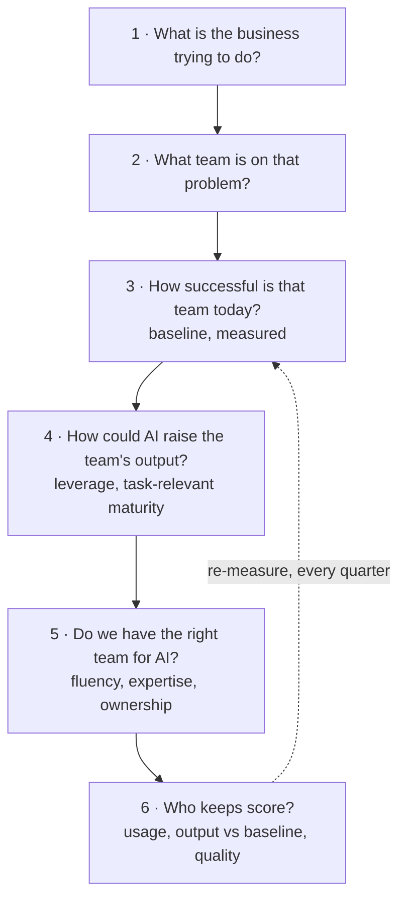

# Team-First AI: The Core Philosophy

Every page in this knowledge base hangs on one conviction: **AI is not a technology decision, it is a team-performance decision.** Companies don't produce output — teams do. So the question is never "what can AI do?" but "what does this team need to achieve, and how does AI raise their output?"

Two of the best management thinkers of the last half-century anchor this view. **Bill Campbell** — the "Trillion Dollar Coach" behind Apple, Google, and Intuit — taught that you solve the team before you solve the problem: get the right people working the right way, and the problem takes care of itself. **Andy Grove** — Intel's legendary CEO and author of *High Output Management* — taught that a manager's only real product is the **output of their team**, and that the highest-value activities are the ones with **leverage**: small inputs that multiply that output. AI, seen through Grove's lens, is the largest new source of leverage since the personal computer. Seen through Campbell's lens, it only works team-first.

That translates into six questions, asked in order. Skip one and AI initiatives drift into demos, tool sprawl, and pilots that never land.

## The Six Questions at a Glance

The order is the discipline: technology enters at Question 4, never at Question 1 — and the loop from Question 6 back to Question 3 is what makes this a management system rather than a one-off project.

## Question 1: What is your business trying to do?

Not "where could we use AI" — what is the *business problem*? Grow revenue in a segment, ship faster than a competitor, serve customers at lower cost, stop losing margin to errors. AI is only ever a means.

- State the problem in business terms, with a number attached
- If you can't name the problem, you're not ready to name the technology
- This is why use-case discovery starts with function owners, not with model demos — see [AI Across Business Functions](/articles/ai-in-business-functions)

## Question 2: What team is on that problem?

Campbell's rule: the team is the unit that gets things done. Identify the actual humans whose work determines the outcome — the sales pod, the support desk, the planning cell, the engineering squad. AI adoption that isn't anchored to a specific team's workflow is adoption in the abstract, and abstract adoption produces abstract results.

- Name the team, its leader, and the workflow it runs
- Adoption lives or dies with the team lead — the most skipped, most decisive layer

## Question 3: How successful is that team today?

Grove insisted: you cannot improve output you don't measure. Before any AI enters the picture, establish the honest baseline — cycle time, cost per case, win rate, backlog age, error rate. This is also the moment for candor, another Campbell trademark: where is the team genuinely strong, and where is it struggling?

- Write the baseline down; every later claim of AI value is measured against it
- At organizational level, this is exactly what the [AI Maturity Audit](/articles/ai-maturity-assessment) does across six dimensions

## Question 4: How could AI make this team better?

Now — and only now — technology. Apply Grove's leverage test: where does a small AI input multiply the team's output? Drafting, summarizing, extracting, triaging, retrieving knowledge; agents taking whole workflow steps. Match autonomy to what Grove called **task-relevant maturity**: the more proven the AI is at a given task, the more autonomy it earns — new tasks get tight human review, mastered tasks get delegation. That is the same judgment a good manager applies to people, applied to machines.

- Pick the one or two highest-leverage interventions, not ten
- Design the human-review step in from day one, scaled to stakes
- The practical entry path is in [Getting Started with AI](/articles/getting-started-with-ai)

## Question 5: Do you have the right team for AI?

Campbell again: first the team, then the problem. Adopting AI is itself a problem that needs a team — fluency in the tools, judgment about data and risk, engineering capacity for integrations, and leadership that models usage rather than delegating enthusiasm. Most organizations have gaps, and that's normal.

- Train broadly (fluency), hire or borrow deep (architecture, integration)
- A fractional AI architect is often the fastest way to close the judgment gap without a full-time hire — the role is described in [The AI Architect's Perspective](/articles/ai-architect-perspective)

## Question 6: Who keeps score?

Grove ran Intel on indicators and regular one-on-ones; Campbell never let a team drift without someone paying attention to how people were actually working. AI needs the same: a named person who continuously tracks whether the team is using AI *optimally* toward the results that matter — usage, output against the baseline, quality incidents, and the gap between what the tools could do and what the team actually does with them.

- One name, on one page, reviewing on a cadence — monthly is enough to start
- Without a scorekeeper, AI usage silently decays to the enthusiasm of individuals

## The Philosophy in One Table

| # | Question | Campbell / Grove principle | Where this knowledge base helps |
|---|---|---|---|
| 1 | What is the business trying to do? | Problems first, in business terms | [Business Functions](/articles/ai-in-business-functions) |
| 2 | What team is on it? | The team is the unit of execution | Team-anchored use cases |
| 3 | How successful is that team today? | Measure output; be candid | [Maturity Audit](/articles/ai-maturity-assessment) |
| 4 | How could AI make the team better? | Leverage; task-relevant maturity | [Getting Started](/articles/getting-started-with-ai) |
| 5 | Do we have the right team for AI? | First the team, then the problem | [AI Architect](/articles/ai-architect-perspective) |
| 6 | Who keeps score? | Indicators, cadence, attention | The architect's operating loop |

## What This Philosophy Rules Out

A philosophy is only useful if it forbids something. This one rules out:

- **Technology-first projects** — "we need a GenAI strategy" with no business problem attached
- **Individual-hero adoption** — one enthusiast automating their own desk while the team's workflow stays untouched
- **Unmeasured pilots** — anything without a baseline from Question 3 and a scorekeeper from Question 6
- **Buying your way out of Question 5** — no platform purchase substitutes for a team that knows why and how to use it

> **Where to go next:** every other article applies one of these questions in depth. If you're new, read [A Brief History of AI](/articles/history-of-ai) for context, then walk the six questions with your own leadership team — that conversation *is* the first deliverable.
